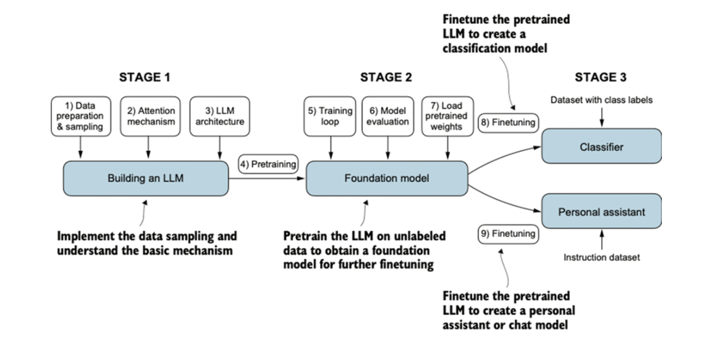

# LLM-notes

This is a note repository for learning the "Build A Large Language Model" book.

This repository contains jupyter notebooks as well as sample python programs for each chapter. It also contains some thoughts & notes during my learning journey.

Here is an overview on how to train a LLM model from scratch:

## Catalog
